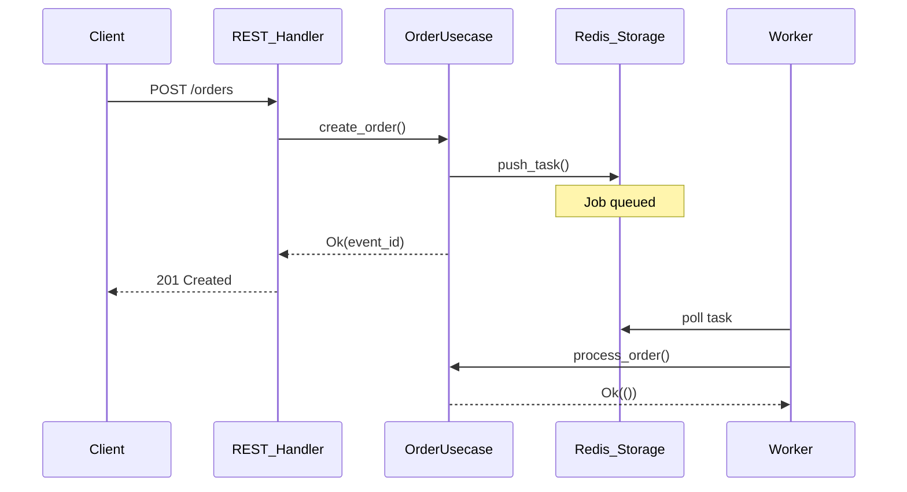

# Clean Architecture Job Processing with Apalis

This project demonstrates a **clean architecture pattern** for building job processing systems with Rust and Apalis, featuring REST API, trait-based usecases, dependency injection, and configurable worker concurrency.

## Table of Contents

- [Architecture Overview](#architecture-overview)
- [Project Structure](#project-structure)
- [Data Flow](#data-flow)
- [Key Patterns](#key-patterns)
- [Worker Concurrency](#worker-concurrency)
- [Graceful Shutdown](#graceful-shutdown)
- [How to Add a New Job Type](#how-to-add-a-new-job-type)
- [Common Issues & Solutions](#common-issues--solutions)

## Architecture Overview

The project is organized into **six main layers** following clean architecture principles:

### 1. Domain Layer (`src/domain/`)
Contains all job types and business entities. **Zero dependencies** on other layers.

- **`jobs.rs`**: All job type definitions (`OrderJob`, `EmailJob`, `AlertJob`)
- **`enums.rs`**: Domain enums (`AlertType`, `Severity`)

### 2. Usecase Layer (`src/usecase/`)
Contains business logic traits and implementations. This is where the **core business rules** live.

- **`order.rs`**: `OrderUsecase` trait + `OrderService` implementation with private helper methods
- **`email.rs`**: `EmailSender` trait + `EmailService` implementation

#### Trait-based Pattern

```rust
#[async_trait]
pub trait OrderUsecase: Send + Sync {
    async fn create_order(&self, event_id: String, device_uuid: String)
        -> Result<String, Box<dyn std::error::Error + Send + Sync>>;
    async fn process_order(&self, job: OrderJob)
        -> Result<(), Box<dyn std::error::Error + Send + Sync>>;
}

pub struct OrderService {
    storage: Arc<StorageFactory>,
}

impl OrderService {
    // Private helper method for scheduling order tasks
    async fn schedule_order_task(&self, event_id: String, device_uuid: String)
        -> Result<(), Box<dyn std::error::Error + Send + Sync>> {
        let mut storage = self.storage.create_order_storage();
        let task = Task::builder(OrderJob {
            event_id: event_id.clone(),
            device_uuid,
        })
        .run_in_seconds(5)
        .build();
        storage.push_task(task).await?;
        Ok(())
    }

    // Private helper method for sending order emails
    async fn send_order_email(&self, event_id: String)
        -> Result<(), Box<dyn std::error::Error + Send + Sync>> {
        // Email scheduling logic...
    }
}

#[async_trait]
impl OrderUsecase for OrderService {
    async fn create_order(&self, event_id: String, device_uuid: String)
        -> Result<String, Box<dyn std::error::Error + Send + Sync>> {
        self.schedule_order_task(event_id.clone(), device_uuid).await?;
        Ok(event_id)
    }

    async fn process_order(&self, job: OrderJob)
        -> Result<(), Box<dyn std::error::Error + Send + Sync>> {
        // Processing logic...
        self.send_order_email(job.event_id).await?;
        Ok(())
    }
}
```

### 3. Handler Layer (`src/handler/`)
Contains HTTP request handlers and job handlers. This layer **delegates to usecases**.

- **`rest/`**: HTTP handlers for Axum REST API
  - `order.rs`: `create_order` endpoint
  - `health.rs`: `health_check` endpoint
- **`workflow/`**: Job handlers for Apalis workers
  - `order.rs`: `order_handler_fn`
  - `email.rs`: `email_handler_fn`

### 4. Server Layer (`src/server/`)
Contains worker registration and REST server setup.

- **`rest/`**: REST API router and server configuration
  - `router.rs`: `create_router()`, `run_server()`
  - `mod.rs`: `ServerState` with `AppContainer`
- **`worker/`**: Worker registration and monitoring
  - `register.rs`: `run_jobs()`, Monitor setup, WorkerConfig

### 5. Storage Layer (`src/storage/`)
Provides storage abstractions for job queues.

- **`redis.rs`**: `StorageFactory` with **shared storage instances**

#### Shared Storage Pattern

```rust
pub struct StorageFactory {
    conn: ConnectionManager,
    order_storage: Arc<RedisStorage<OrderJob>>,  // Shared!
    email_storage: Arc<RedisStorage<EmailJob>>,  // Shared!
    // ...
}

impl StorageFactory {
    pub fn new(conn: ConnectionManager) -> Self {
        let order_storage = Arc::new(RedisStorage::new(conn.clone()));
        // ...
    }

    pub fn create_order_storage(&self) -> RedisStorage<OrderJob> {
        (*self.order_storage).clone()  // Clone Arc, not new storage
    }
}
```

**Why?** Producer and consumer must use the **same storage instance** to share the same Redis queue.

### 6. Container (`container.rs`)
Dependency injection container that provides all dependencies.

```rust
#[derive(Clone)]
pub struct AppContainer {
    pub storage: Arc<StorageFactory>,
    pub email_service: Arc<dyn EmailSender>,
    pub order_service: Arc<dyn OrderUsecase>,
}

impl AppContainer {
    pub fn new(storage: Arc<StorageFactory>) -> Self {
        let order_service = Arc::new(OrderService::new(storage.clone()))
            as Arc<dyn OrderUsecase>;
        let email_service = Arc::new(EmailService) as Arc<dyn EmailSender>;

        Self { storage, email_service, order_service }
    }
}
```

## Project Structure

```
rust-apalis-test/
├── src/
│   ├── lib.rs                 # Public API exports
│   ├── container.rs           # AppContainer (DI)
│   ├── domain/                # Job types & domain entities
│   │   ├── jobs.rs           # OrderJob, EmailJob, AlertJob
│   │   ├── enums.rs          # Domain enums
│   │   └── mod.rs
│   ├── usecase/               # Business logic (traits)
│   │   ├── order.rs          # OrderUsecase + OrderService
│   │   ├── email.rs          # EmailSender + EmailService
│   │   └── mod.rs
│   ├── handler/               # Request/Job handlers
│   │   ├── rest/             # HTTP handlers (Axum)
│   │   │   ├── order.rs      # POST /orders
│   │   │   ├── health.rs     # GET /health
│   │   │   └── mod.rs
│   │   ├── workflow/         # Job handlers (Apalis)
│   │   │   ├── order.rs      # order_handler_fn
│   │   │   ├── email.rs      # email_handler_fn
│   │   │   └── mod.rs
│   │   └── mod.rs
│   ├── server/                # Server setup & worker registration
│   │   ├── rest/             # REST API
│   │   │   ├── router.rs     # Router & server config
│   │   │   └── mod.rs        # ServerState
│   │   ├── worker/           # Worker registration
│   │   │   ├── register.rs   # run_jobs, monitor, WorkerConfig
│   │   │   └── mod.rs
│   │   └── mod.rs
│   └── storage/               # Storage abstraction
│       ├── redis.rs          # StorageFactory (shared instances)
│       └── mod.rs
├── bins/                      # Binary executables
│   ├── rest/main.rs          # REST API server
│   └── worker/main.rs        # Worker
├── Cargo.toml
├── ARCHITECTURE.md
└── README.md
```

## Data Flow

### Creating a Job via REST API



## Key Patterns

### 1. Trait-based Usecase

Business logic is defined as **traits**, allowing for:
- Multiple implementations
- Easy testing with mocks
- Dependency injection via trait objects

```rust
// Define trait
#[async_trait]
pub trait OrderUsecase: Send + Sync {
    async fn process_order(&self, job: OrderJob) -> Result<(), ...>;
}

// Implement for struct
pub struct OrderService { ... }

#[async_trait]
impl OrderUsecase for OrderService {
    async fn process_order(&self, job: OrderJob) -> Result<(), ...> {
        // Business logic here
    }
}

// Use as trait object in container
pub order_service: Arc<dyn OrderUsecase>
```

### 2. Dependency Injection

All dependencies are provided via `AppContainer`:

```rust
let container = AppContainer::new(storage);
let state = ServerState::new(container);
```

This makes testing easy - just create a test container with mock implementations.

### 3. Shared Storage Instances

**Critical:** Producer and consumer must use the same `RedisStorage` instance:

```rust
// ✅ CORRECT - Shared Arc
pub struct StorageFactory {
    order_storage: Arc<RedisStorage<OrderJob>>,
}

pub fn create_order_storage(&self) -> RedisStorage<OrderJob> {
    (*self.order_storage).clone()  // Clone Arc
}

// ❌ WRONG - New instance each time
pub fn create_order_storage(&self) -> RedisStorage<OrderJob> {
    RedisStorage::new(self.conn.clone())  // Different queue!
}
```

### 4. Trait Objects in Handlers

Workers must use **trait objects**, not concrete types:

```rust
// ✅ CORRECT - Trait object
pub async fn order_handler_fn(
    job: OrderJob,
    ctx: Data<std::sync::Arc<dyn OrderUsecase>>,  // Trait object
    attempt: Attempt,
) -> Result<(), ...>

// ❌ WRONG - Concrete type
pub async fn order_handler_fn(
    job: OrderJob,
    ctx: Data<std::sync::Arc<OrderService>>,  // Concrete!
    attempt: Attempt,
) -> Result<(), ...>
```

## Worker Concurrency

### Configuration

Worker concurrency is configured via `WorkerConfig`:

```rust
pub struct WorkerConfig {
    pub order_concurrency: usize,  // Number of parallel order workers
    pub email_concurrency: usize,  // Number of parallel email workers
}

impl Default for WorkerConfig {
    fn default() -> Self {
        Self {
            order_concurrency: 2,  // Default: 2 workers
            email_concurrency: 2,
        }
    }
}
```

### Usage

```rust
// Use default concurrency (2 workers per type)
run_jobs(&storage_factory, container).await?;

// Or configure custom concurrency
let worker_config = WorkerConfig {
    order_concurrency: 4,  // 4 parallel order workers
    email_concurrency: 2,  // 2 parallel email workers
};

run_jobs_with_config(&storage_factory, container, worker_config).await?;
```

### Startup Output

```
Worker ID: 1771412612
Worker Concurrency:
  - Order: 3 instances
  - Email: 2 instances

Registering order worker...
Registering email worker...

Starting monitor...
All workers registered successfully!

  → Starting order worker instance 1/3
  → Starting order worker instance 2/3
  → Starting order worker instance 3/3
  → Starting email worker instance 1/2
  → Starting email worker instance 2/2
```

### Choosing Concurrency

**Guidelines:**

1. **CPU-bound tasks** (heavy computation):
   ```rust
   order_concurrency: num_cpus::get() - 1
   ```

2. **I/O-bound tasks** (API calls, database, network):
   ```rust
   order_concurrency: num_cpus::get() * 2
   ```

3. **Mixed workload**:
   - Start with default (2)
   - Monitor queue depth in Redis
   - Increase if tasks pile up
   - Decrease if CPU/memory saturated

## Graceful Shutdown

Both worker and REST API implement graceful shutdown via Ctrl+C handler:

### Worker Shutdown

```rust
// Setup signal handler
let (shutdown_tx, mut shutdown_rx) = tokio::sync::oneshot::channel();

tokio::spawn(async move {
    match tokio::signal::ctrl_c().await {
        Ok(()) => {
            println!("\nReceived shutdown signal, stopping worker...");
            let _ = shutdown_tx.send(());
        }
        // ...
    }
});

// Run until shutdown signal
tokio::select! {
    result = run_jobs(...) => { result?; }
    _ = &mut shutdown_rx => {
        println!("Worker shutting down gracefully...");
    }
}
```

### REST API Shutdown

Similar pattern for REST API server.

**Benefits:**
- Clean exit on Ctrl+C
- Prevents "worker is still active" errors
- Allows multiple restarts without Redis flush

## How to Add a New Job Type

Follow these steps to add a new job type (e.g., `NotificationJob`):

### Step 1: Define the Job in Domain Layer

Add to `src/domain/jobs.rs`:

```rust
#[derive(Debug, Serialize, Deserialize, Clone)]
pub struct NotificationJob {
    pub user_id: String,
    pub message: String,
    pub channel: String,
}
```

Export in `src/domain/mod.rs`:

```rust
pub use jobs::NotificationJob;
```

### Step 2: Create Usecase Trait & Implementation

Create `src/usecase/notification.rs`:

```rust
use async_trait::async_trait;
use crate::domain::jobs::NotificationJob;

#[async_trait]
pub trait NotificationUsecase: Send + Sync {
    async fn send_notification(&self, job: NotificationJob)
        -> Result<(), Box<dyn std::error::Error + Send + Sync>>;
}

pub struct NotificationService;

#[async_trait]
impl NotificationUsecase for NotificationService {
    async fn send_notification(&self, job: NotificationJob)
        -> Result<(), Box<dyn std::error::Error + Send + Sync>> {
        println!("Sending notification to user {} via {}: {}",
            job.user_id, job.channel, job.message);
        Ok(())
    }
}
```

Export in `src/usecase/mod.rs`:

```rust
pub mod notification;
pub use notification::{NotificationUsecase, NotificationService};
```

### Step 3: Create Workflow Handler

Create `src/handler/workflow/notification.rs`:

```rust
use apalis::prelude::*;
use apalis_core::task::attempt::Attempt;
use crate::domain::jobs::NotificationJob;
use crate::usecase::{NotificationService, NotificationUsecase};

pub async fn notification_handler_fn(
    job: NotificationJob,
    ctx: Data<std::sync::Arc<dyn NotificationUsecase>>,
    attempt: Attempt,
) -> Result<(), Box<dyn std::error::Error + Send + Sync>> {
    println!("=== NOTIFICATION HANDLER CALLED ===");
    println!("Attempt: {}", attempt.current());

    ctx.send_notification(job).await?;

    Ok(())
}
```

Export in `src/handler/workflow/mod.rs`:

```rust
pub mod notification;
pub use notification::notification_handler_fn;
```

### Step 4: Update StorageFactory

Add to `src/storage/redis.rs`:

```rust
use crate::domain::jobs::NotificationJob;

pub struct StorageFactory {
    conn: ConnectionManager,
    order_storage: Arc<RedisStorage<OrderJob>>,
    email_storage: Arc<RedisStorage<EmailJob>>,
    notification_storage: Arc<RedisStorage<NotificationJob>>,  // NEW
    alert_storage: Arc<RedisStorage<AlertJob>>,
}

impl StorageFactory {
    pub fn new(conn: ConnectionManager) -> Self {
        let order_storage = Arc::new(RedisStorage::new(conn.clone()));
        let email_storage = Arc::new(RedisStorage::new(conn.clone()));
        let notification_storage = Arc::new(RedisStorage::new(conn.clone()));  // NEW
        let alert_storage = Arc::new(RedisStorage::new(conn));

        Self {
            conn,
            order_storage,
            email_storage,
            notification_storage,
            alert_storage,
        }
    }

    pub fn create_notification_storage(&self) -> RedisStorage<NotificationJob> {
        (*self.notification_storage).clone()
    }
}
```

### Step 5: Update AppContainer

Add to `src/container.rs`:

```rust
use crate::usecase::{NotificationService, NotificationUsecase};

#[derive(Clone)]
pub struct AppContainer {
    pub storage: Arc<StorageFactory>,
    pub email_service: Arc<dyn EmailSender>,
    pub order_service: Arc<dyn OrderUsecase>,
    pub notification_service: Arc<dyn NotificationUsecase>,  // NEW
}

impl AppContainer {
    pub fn new(storage: Arc<StorageFactory>) -> Self {
        let order_service = Arc::new(OrderService::new(storage.clone()))
            as Arc<dyn OrderUsecase>;
        let email_service = Arc::new(EmailService) as Arc<dyn EmailSender>;
        let notification_service = Arc::new(NotificationService)  // NEW
            as Arc<dyn NotificationUsecase>;

        Self {
            storage,
            email_service,
            order_service,
            notification_service,
        }
    }
}
```

### Step 6: Register Worker

Add to `src/server/worker/register.rs`:

```rust
use crate::handler::workflow::notification::notification_handler_fn;
use crate::AppContainer;

pub struct WorkerConfig {
    pub order_concurrency: usize,
    pub email_concurrency: usize,
    pub notification_concurrency: usize,  // NEW
}

pub async fn run_jobs_with_config(
    storage_factory: &Arc<StorageFactory>,
    container: AppContainer,
    config: WorkerConfig,
) -> Result<(), Box<dyn std::error::Error>> {
    let mut monitor = Monitor::new();

    // ... existing workers ...

    // NEW: Register notification worker
    println!("Registering notification worker...");
    let notification_storage = storage_factory.create_notification_storage();
    let notification_backoff = ExponentialBackoffMaker::new(
        Duration::from_secs(2),
        Duration::from_secs(10),
        0.5,
        HasherRng::new(),
    )?.make_backoff();

    monitor = monitor.register({
        let notification_service = container.notification_service.clone();
        let worker_id = worker_id.clone();
        let concurrency = config.notification_concurrency;

        move |count| {
            if count < concurrency {
                println!("  → Starting notification worker instance {}/{}", count + 1, concurrency);
            }
            WorkerBuilder::new(format!("notification-worker-{}-{}", worker_id, count))
                .backend(notification_storage.clone())
                .data(notification_service.clone())
                .retry(RetryPolicy::retries(3).with_backoff(notification_backoff.clone()))
                .build(notification_handler_fn)
        }
    });

    println!();
    println!("Starting monitor...");
    println!("All workers registered successfully!");
    println!();

    monitor.run().await?;
    Ok(())
}
```

### Step 7: (Optional) Add REST Endpoint

If you want HTTP API for creating notifications, create `src/handler/rest/notification.rs`:

```rust
use axum::{extract::State, http::StatusCode, response::IntoResponse, Json};
use serde::Deserialize;
use crate::server::rest::ServerState;

#[derive(Deserialize)]
pub struct CreateNotificationRequest {
    pub user_id: String,
    pub message: String,
    pub channel: String,
}

pub async fn create_notification(
    State(state): State<ServerState>,
    Json(payload): Json<CreateNotificationRequest>,
) -> impl IntoResponse {
    // Use usecase to create job
    // Similar to create_order in src/handler/rest/order.rs
}
```

Add route in `src/server/rest/router.rs`:

```rust
use crate::handler::rest::notification::create_notification;

pub fn create_router(state: ServerState) -> Router {
    Router::new()
        .route("/orders", post(create_order))
        .route("/notifications", post(create_notification))  // NEW
        .route("/health", get(health_check))
        .with_state(state)
}
```

## Running the Project

### Start Redis

```bash
redis-server
```

### Start the Worker

```bash
cargo run --bin worker
```

### Start the REST API

```bash
cargo run --bin rest
```

### Test with cURL

```bash
curl -X POST http://localhost:3000/orders \
  -H "Content-Type: application/json" \
  -d '{"event_id":"EVT-001","device_uuid":"DEV-123"}'
```

## Design Benefits

1. **Clean Architecture** - Clear separation between layers
2. **Trait-based** - Flexible business logic via traits
3. **Dependency Injection** - Easy testing with mocks
4. **Type Safety** - Trait objects ensure compile-time checks
5. **Shared Storage** - Single RedisStorage instance per job type
6. **Easy to Extend** - Adding new jobs requires touching specific files only
7. **Testability** - Each layer can be tested independently
8. **Worker Concurrency** - Configurable parallel processing per job type
9. **Graceful Shutdown** - Clean exit handling for both worker and REST API
10. **Unique Worker IDs** - Timestamp-based identification prevents conflicts

## Common Issues & Solutions

### Issue: Worker not consuming tasks

**Symptom:** Tasks in Redis but worker doesn't process them.

**Check task status:**
```bash
redis-cli HGETALL "rust_apalis_test::domain::jobs::OrderJob:meta:<TASK_ID>"
```

**Solution:** Ensure handler uses trait object:
```rust
// ✅ CORRECT
ctx: Data<std::sync::Arc<dyn OrderUsecase>>

// ❌ WRONG
ctx: Data<std::sync::Arc<OrderService>>
```

### Issue: Storage queue mismatch

**Symptom:** Producer pushes to queue A, consumer listens to queue B.

**Solution:** Ensure `StorageFactory` returns **shared Arc instances**, not new storage each time.

See [Shared Storage Pattern](#3-shared-storage-instances) above.

### Issue: Worker restart fails with "worker is still active"

**Symptom:** Worker fails to start after crash/force-quit.

**Solution:**
- Wait 60 seconds for Redis timeout, OR
- Flush Redis: `redis-cli FLUSHALL`

**Prevention:** Use graceful shutdown (Ctrl+C) instead of force-quit.

### Issue: Adjusting worker concurrency

**Current approach:** Configure via `WorkerConfig`:

```rust
let worker_config = WorkerConfig {
    order_concurrency: 3,  // 3 parallel order workers
    email_concurrency: 2,  // 2 parallel email workers
};

run_jobs_with_config(&storage_factory, container, worker_config).await?;
```

**Guidelines:**
- **CPU-bound tasks**: `num_cpus - 1` workers
- **I/O-bound tasks**: `num_cpus * 2` workers
- **Mixed tasks**: Profile and adjust based on metrics
